# Pemrograman Berbasis Framework - Pertemuan 7

## Introduction

I'm Maulidio Farhan Rizkullah with student ID 2141720041. I'm currently study in TI-3C class of State Polytechnic of Malang. With a passion for technology and a knack for problem-solving, I'm constantly seeking to expand my knowledge and skills in the field of programming.

## Table of Contents

- [Introduction](#introduction)
- [Table of Contents](#table-of-contents)
- [Author](#author)
- [Documentation](#documentation)
- [Contact Me](#contact-me)

## Author

- [@DioGitH](https://www.github.com/DioGitH)

## Documentation

### Tutorial 1

#### Langkah 1
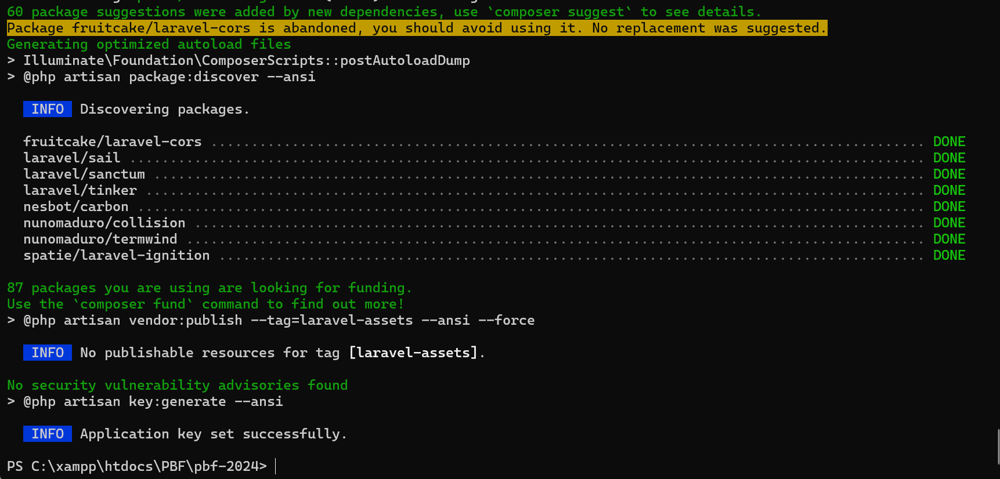

#### Langkah 2
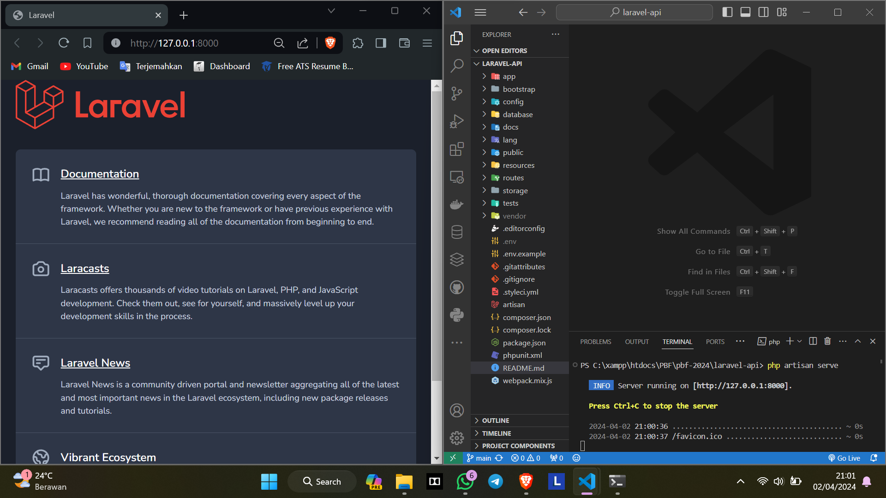

#### Langkah 3
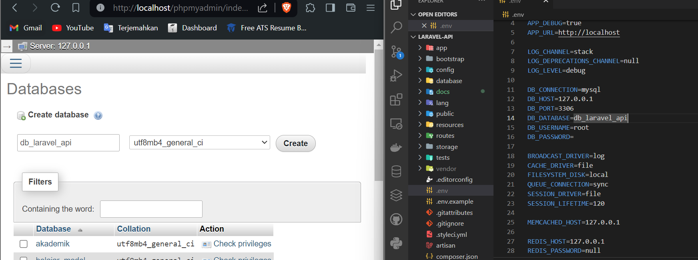

#### Langkah 4
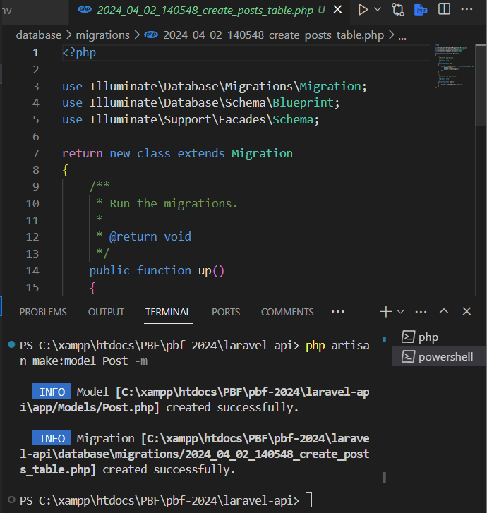

#### Langkah 5
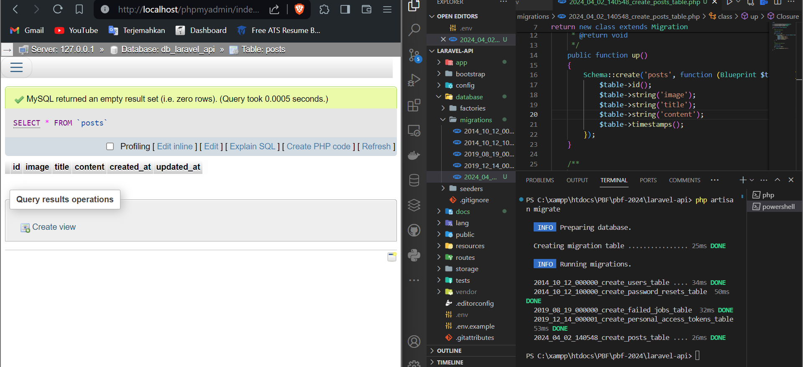

#### Langkah 6
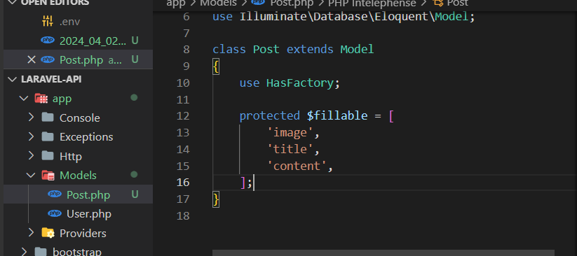

#### Langkah 7


### Tutorial 2

#### Langkah 1
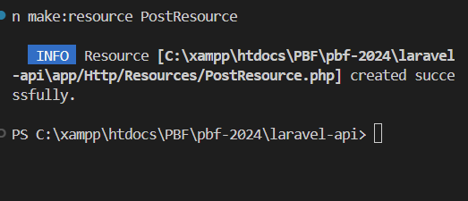

#### Langkah 2
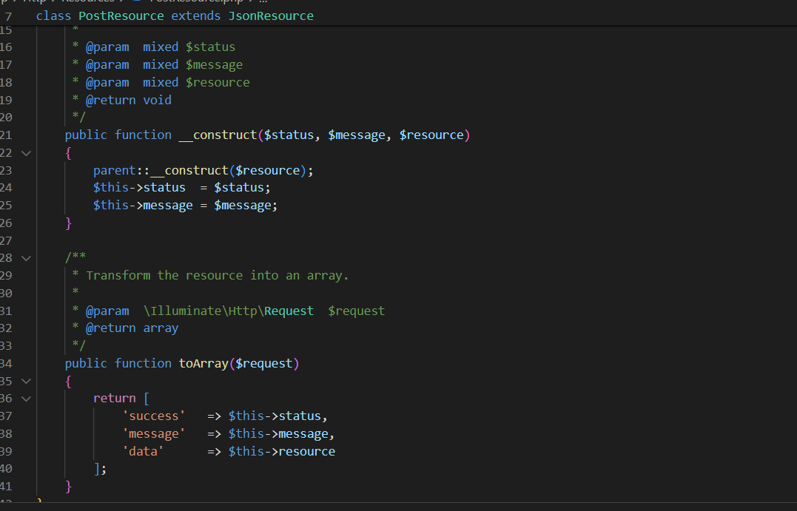

### Tutorial 3

#### Langkah 1
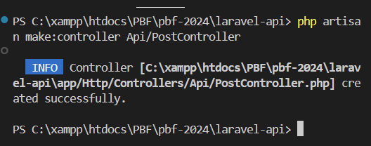

#### Langkah 2
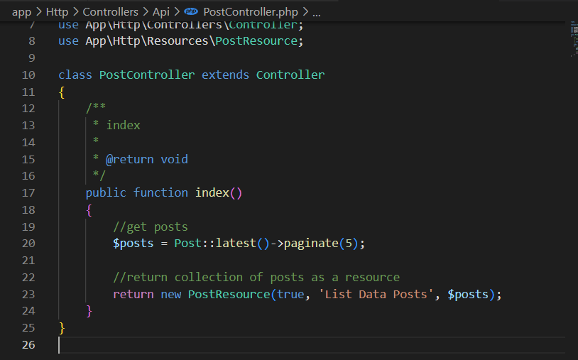

#### Langkah 3
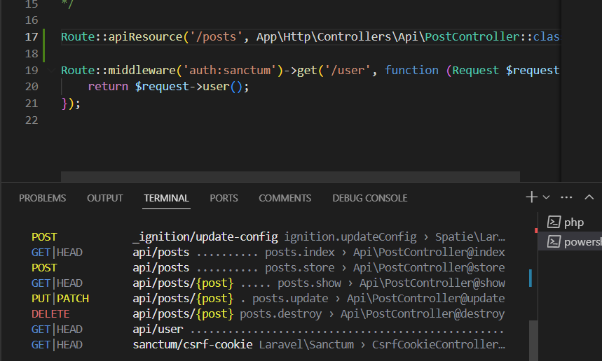

#### Langkah 4
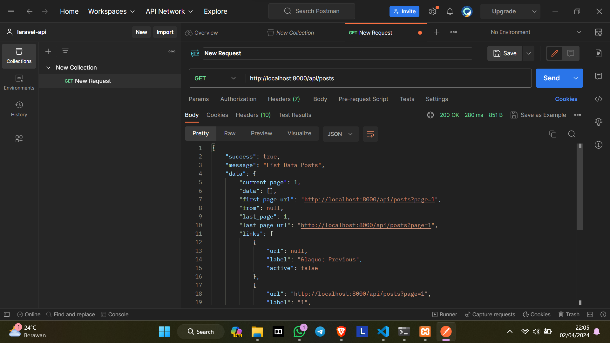

### Tutorial 4

#### Langkah 1
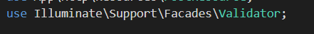

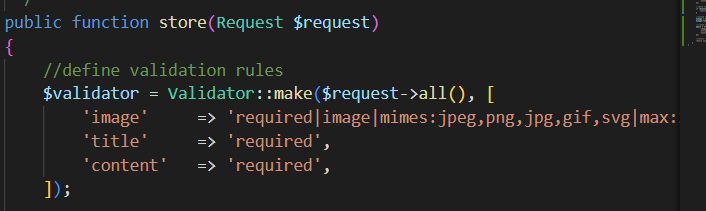

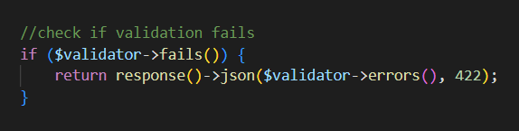

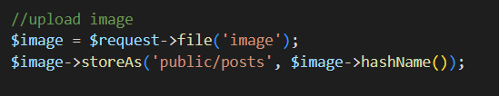

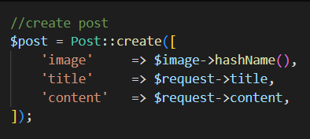

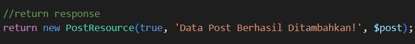

#### Langkah 2

***Pesan error***
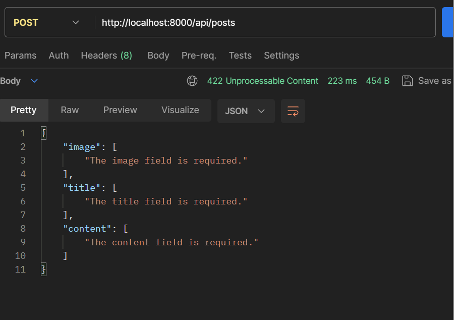

***Setelah Berhasil***
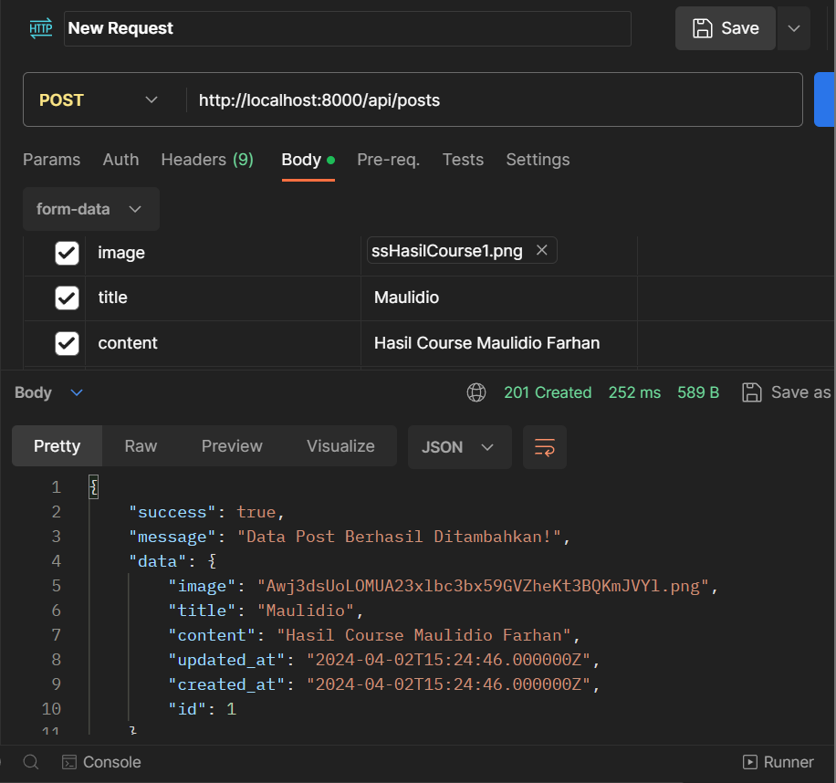

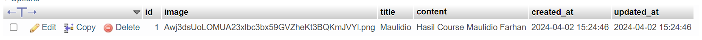

### Tutorial 5

#### Langkah 1
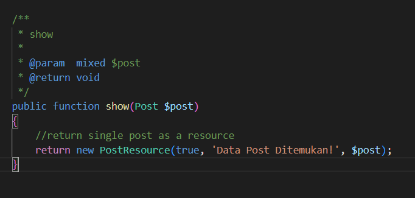

***Hasil***
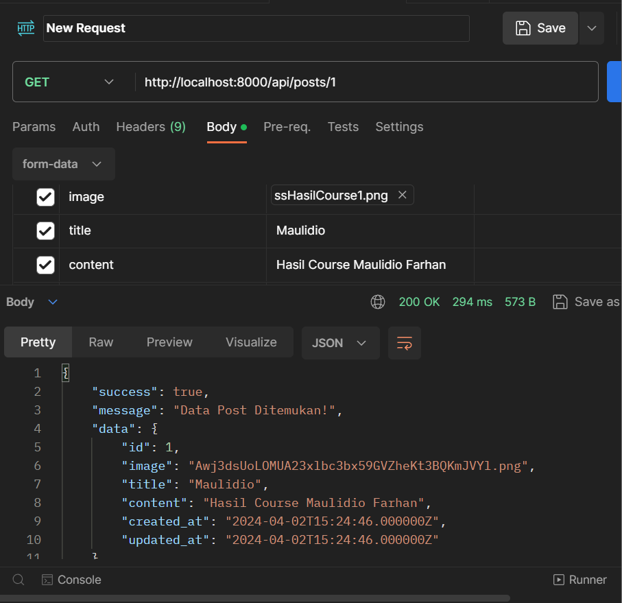

### Tutorial 6

#### Langkah 1
Menambahkan kode dibawah ini pada PostController
```php
    /**
     * update
     *
     * @param  mixed $request
     * @param  mixed $post
     * @return void
     */
    public function update(Request $request, Post $post)
    {
        //define validation rules
        $validator = Validator::make($request->all(), [
            'title'     => 'required',
            'content'   => 'required',
        ]);

        //check if validation fails
        if ($validator->fails()) {
            return response()->json($validator->errors(), 422);
        }

        //check if image is not empty
        if ($request->hasFile('image')) {

            //upload image
            $image = $request->file('image');
            $image->storeAs('public/posts', $image->hashName());

            //delete old image
            Storage::delete('public/posts/'.$post->image);

            //update post with new image
            $post->update([
                'image'     => $image->hashName(),
                'title'     => $request->title,
                'content'   => $request->content,
            ]);

        } else {

            //update post without image
            $post->update([
                'title'     => $request->title,
                'content'   => $request->content,
            ]);
        }

        //return response
        return new PostResource(true, 'Data Post Berhasil Diubah!', $post);
    }
```

***Hasil***
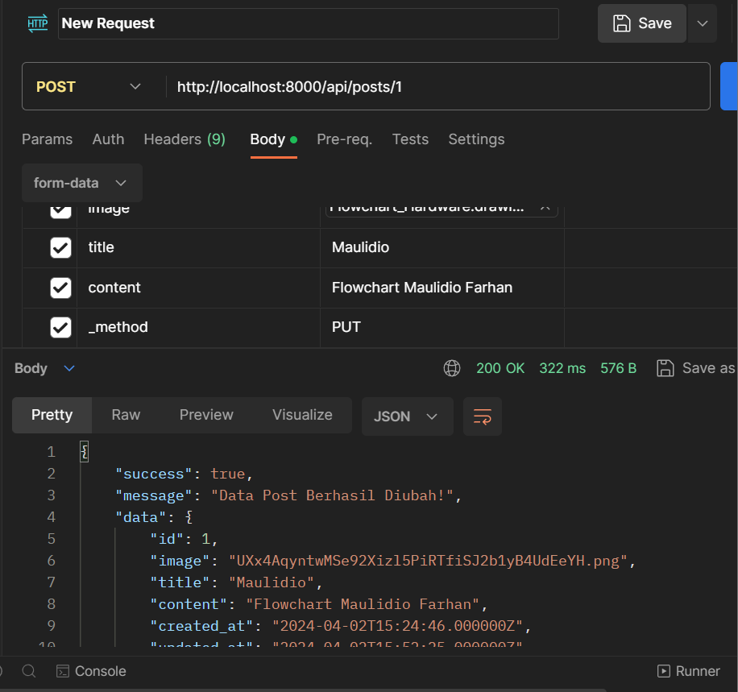


### Tutorial 7

#### Langkah 1
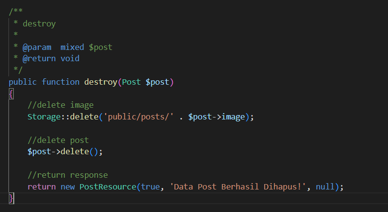

***Hasil***
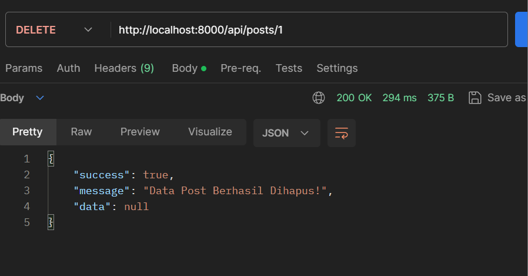

Database kosong kembali karena data telah berhasil dihapus
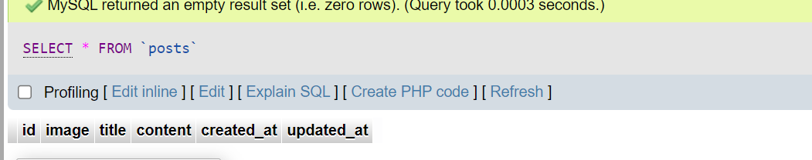


## Contact Me

[](https://mail.google.com/mail/u/0/?view=cm&tf=1&fs=1&to=maulidiobisnis16@gmail.com)
[](https://api.whatsapp.com/send/?phone=6285289589391&text&type=phone_number&app_absent=0)
[](https://t.me/Maulidio16)


