# Pemrograman Berbasis Framework - Pertemuan 3

## Introduction

I'm Maulidio Farhan Rizkullah with student ID 2141720041. I'm currently study in TI-3C class of State Polytechnic of Malang. With a passion for technology and a knack for problem-solving, I'm constantly seeking to expand my knowledge and skills in the field of programming.

## Table of Contents

- [Introduction](#introduction)
- [Table of Contents](#table-of-contents)
- [Author](#author)
- [Documentation](#documentation)
- [Contact Me](#contact-me)

## Author

- [@DioGitH](https://www.github.com/DioGitH)

## Documentation

### Praktikum 1

#### Langkah 1
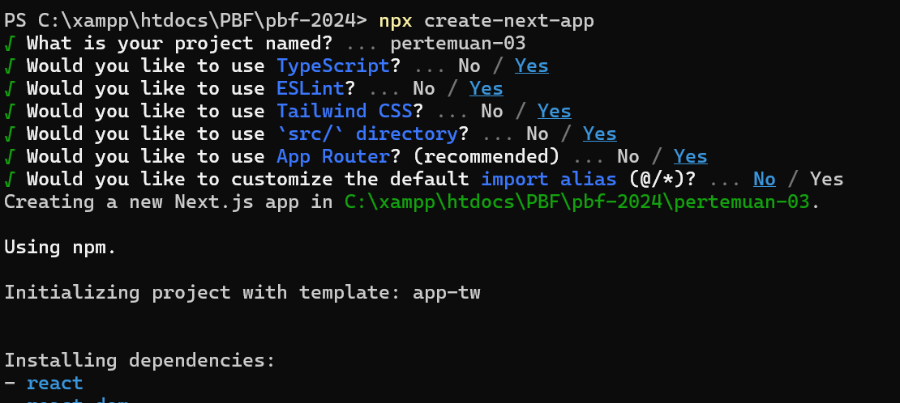

#### Langkah 2
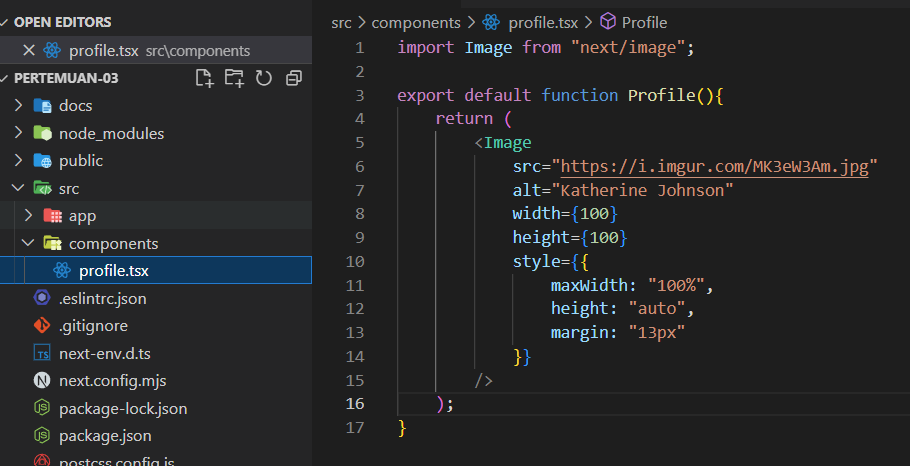

#### Langkah 3
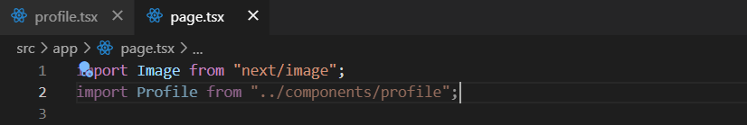

#### Soal 1
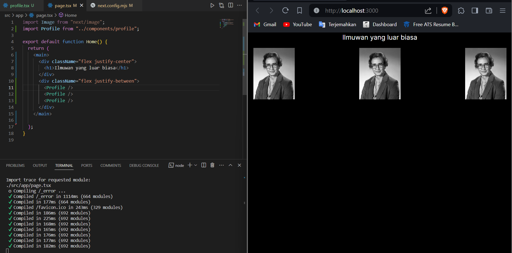

Terjadi error karena diperlukan pengubahan pada bagian next.config.mjs dengan menambahkan domain 'i.imgur.com' agar dapat mengoptimalkan gambar dari domain tersebut
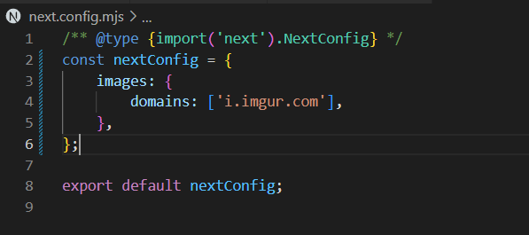

### Praktikum 2

#### Langkah 1
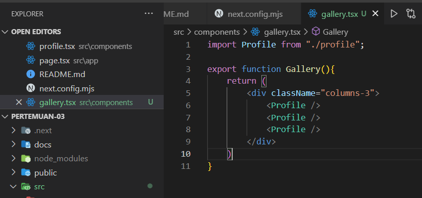

#### Langkah 2
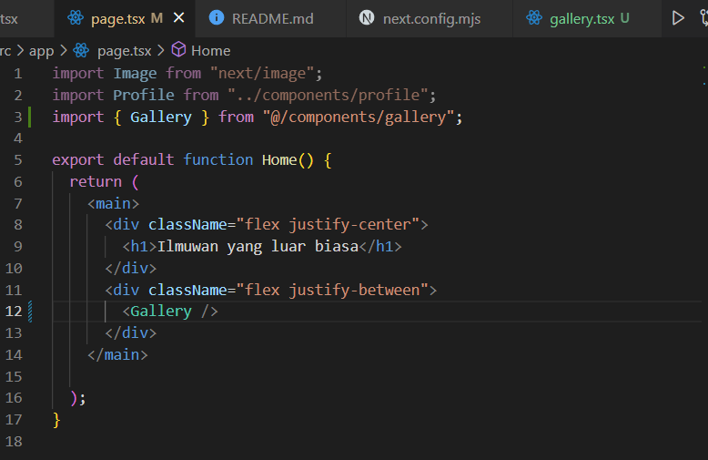

#### Soal 2
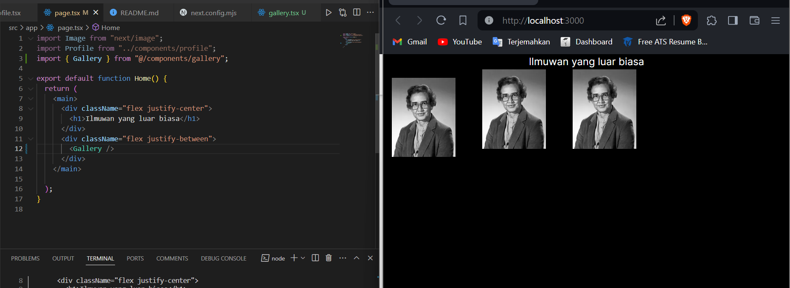
Tampilan nya hampir sama tetapi berubah lebih rapat karena dalam komponen gallery terdapat css columns-3 yang membuat gambar lebih rapat. Pada page.tsx akan memanggil komponen gallery yangmana pada komponen gallery tersebut memanggil komponen profile.tsx 

#### Soal 3
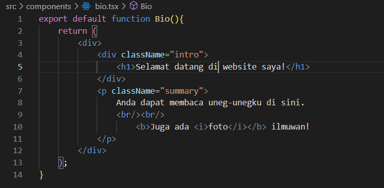
Pertama saya membungkus elemen dengan satu tag parent agar tidak terjadi error, setelah itu saya melakukan penutupan tag pada br agar tidak terjadi error, dan yang terakhir saya mengubah tempat tag i dan b agar tidak terjadi error, semua hal tersebut saya ikuti menurut aturan JSX

### Praktikum 3

#### Langkah 1
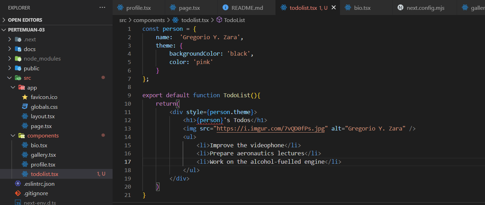

#### Soal 4
Menambahkan person.name pada kode yang error

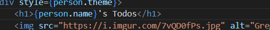

#### Langkah 2
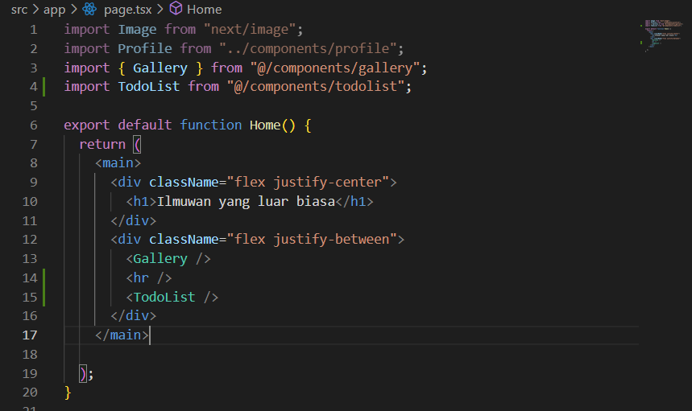

#### Soal 5
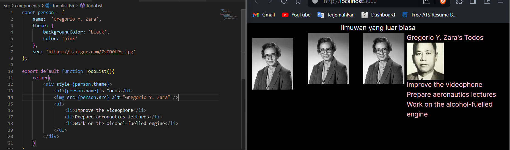
Tidak ada perbedaan pada tampilan web 

#### Langkah 3
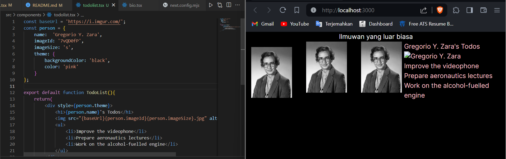

#### Soal 6
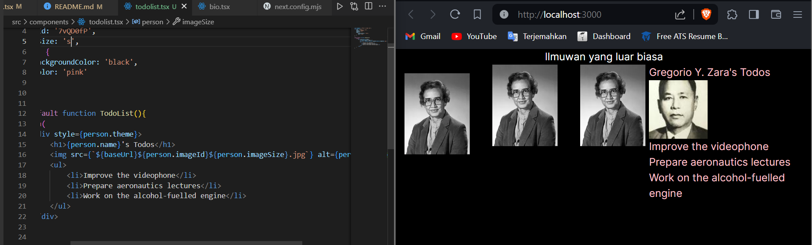
tampilan saat ini tetap, tetapi pada kodingan perlu ditambahkan {}, $, dan `` agar url dapat digunakan dengan cara pemanggilan tersebut. Dengan cara pemanggilan tersebut, saya dapat mengubah imageId dan imageSize menjadi lebih fleksibel tanpa harus mengubah link secara keseluruhan

### Praktikum 4

#### Langkah 1
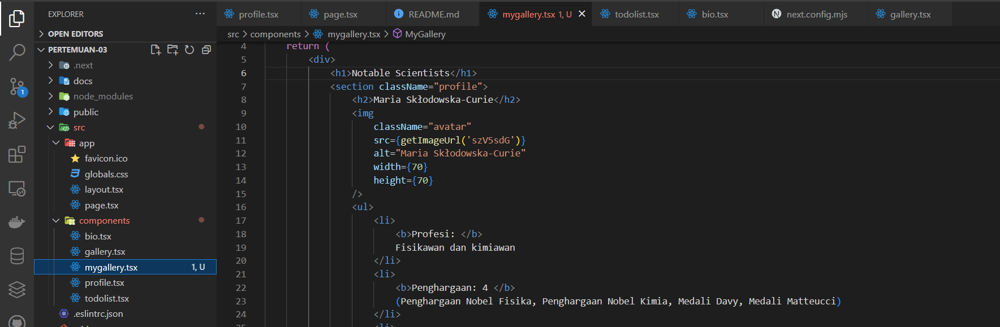

#### Soal 7
```jsx
import { getImageUrl } from '@/utils/utils';

interface Person {
    name: string;
    imageId: string;
}
interface Penghargaan{
    jumlah: string;
    namaPenghargaan: string;
}

function MyProfile({ person, size, profesi, penghargaan, menemukan }: {person: Person; size:number; profesi: string; penghargaan: Penghargaan; menemukan: string}) {
    return (
        <section className="profile">
            <h2>{person.name}</h2>
            
            <ul>
                <li>
                    <b>Profesi: </b>
                    {profesi}
                </li>
                <li>
                    <b>Penghargaan: {penghargaan.jumlah} </b>
                    ({penghargaan.namaPenghargaan})
                </li>
                <li>
                    <b>Telah Menemukan: </b>
                    {menemukan}
                </li>
            </ul>
        </section>
    );
}

export default function MyGallery() {
    return (
        <div>
            <h1>Notable Scientists</h1>
            <MyProfile person={{ name: 'Maria Sklodowska-Curie', imageId: 'szV5sdG' }} size={70} profesi='Fisikawan dan kimiawan' penghargaan={{ jumlah: '4', namaPenghargaan: 'Penghargaan Nobel Fisika, Penghargaan Nobel Kimia, Medali Davy, Medali Matteucci' }} menemukan='polonium (unsur kimia)'/>
            <br />
            <MyProfile person={{ name: 'Katsuko Saruhashi', imageId: 'YfeOqp2Ahli Geokimia' }} size={70} profesi='Ahli Geokimia' penghargaan={{ jumlah: '2', namaPenghargaan: 'Penghargaan Miyake Geokimia, Penghargaan Tanaka' }} menemukan='sebuah metode untuk mengukur karbon dioksida pada air laut' />
        </div>
    );
}
```

***Hasil soal 7***
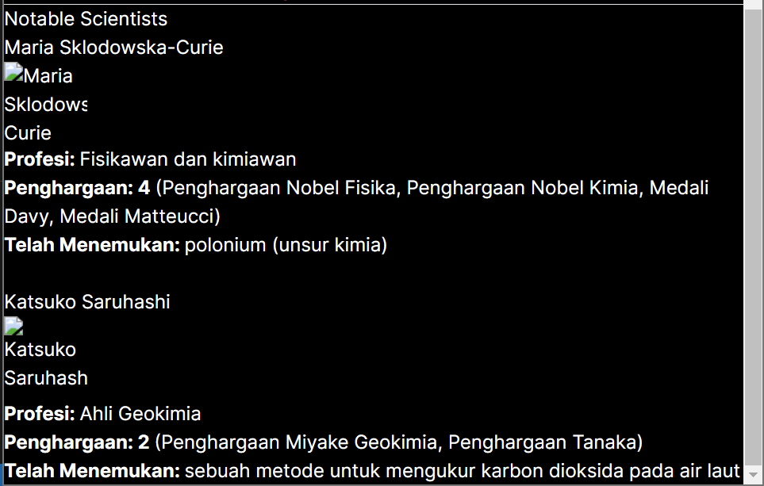
(Gambar tidak muncul dikarenakan kode pada bagian getimageurl masih belum fiks)

#### Langkah 2
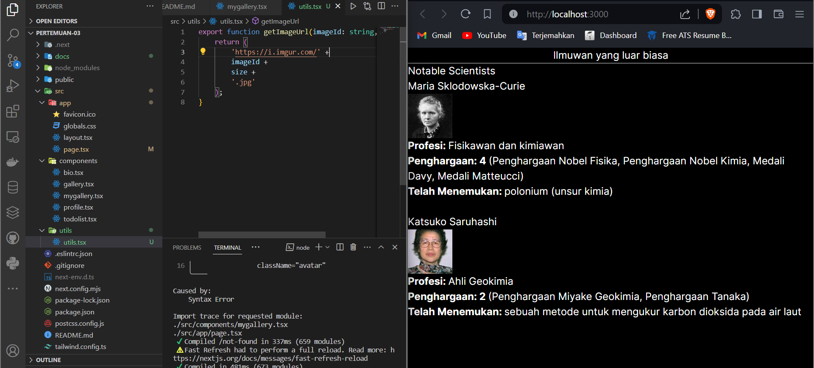

#### Langkah 3
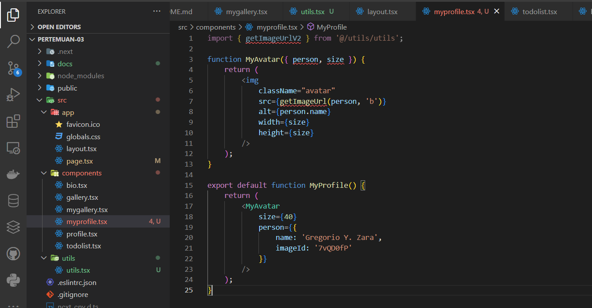

***Perbaikan***
```jsx
import { getImageUrlV2 } from '@/utils/utils';

interface Person {
    name: string;
    imageId: string;
}

function MyAvatar({ person, size }: {person: Person; size: number}) {
    return (
        
    );
}

export default function MyProfile() {
    return (
        <MyAvatar
            size={40}
            person={{
                name: 'Gregorio Y. Zara',
                imageId: '7vQD0fP'
            }}
        />
    );
}
```

#### Soal 8
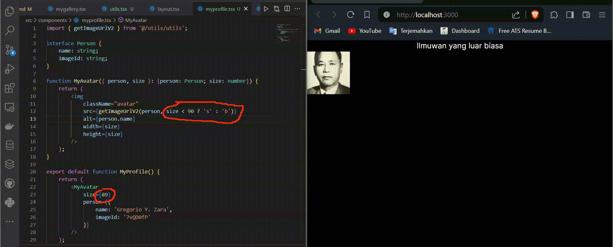

***Penjelasan Soal 8***

Dengan ditambahkan nya ternary operator pada bagian getImageUrl seperti ini ``` size < 90 ? 's' : 'b'``` , maka jika size kurang dari 90, gambar akan otomatis berubah ke size 's' dan jika lebih dari 90 maka akan berubah ke size 'b', hal ini dapat terlihat dari perbedaan kerapatan pixel gambar pada saat size berada dibawah 90 maka gambar akan lebih blur dan sebaliknya. (sayangnya saya tidak bisa menunjukkan secara jelas perbedaan gambarnya karena pada saat dibuka linknya pada tab baru, website nya merespon 404, jadi saya memberikan perbandingan melalui gif)

#### Langkah 9


#### Soal 9
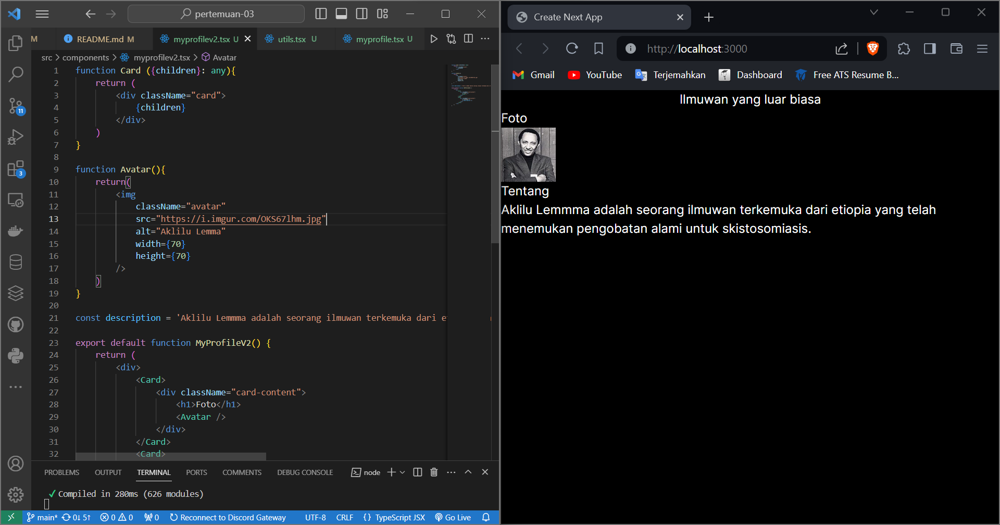
Yang saya lakukan pada komponen Card tersebut adalah mengisi prop children dengan berbagai konten. Komponen card fleksibel terhadap isi dari konten yang di render di dalam komponen tersebut sehingga dapat dijadikan sebagai pembungkus konten lainnya.


## Contact Me

[](https://mail.google.com/mail/u/0/?view=cm&tf=1&fs=1&to=maulidiobisnis16@gmail.com)
[](https://api.whatsapp.com/send/?phone=6285289589391&text&type=phone_number&app_absent=0)
[](https://t.me/Maulidio16)


