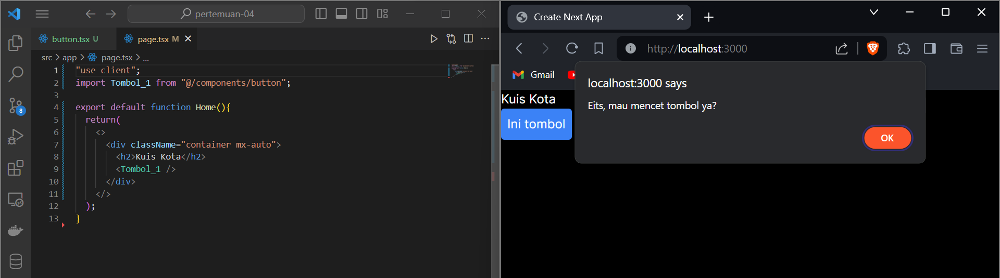

# Pemrograman Berbasis Framework - Pertemuan 4

## Introduction

I'm Maulidio Farhan Rizkullah with student ID 2141720041. I'm currently study in TI-3C class of State Polytechnic of Malang. With a passion for technology and a knack for problem-solving, I'm constantly seeking to expand my knowledge and skills in the field of programming.

## Table of Contents

- [Introduction](#introduction)
- [Table of Contents](#table-of-contents)
- [Author](#author)
- [Documentation](#documentation)
- [Contact Me](#contact-me)

## Author

- [@DioGitH](https://www.github.com/DioGitH)

## Documentation

### Praktikum 1

#### Langkah 1


***Hasil***


#### Langkah 2


***Pesan error***


***Hasil***


### Praktikum 2


***Hasil***


- ***Penjelasan:***
Pada praktikum tersebut parameter pada Tombol_2 diisi melalui file `page.tsx` pada saat pemanggilan Tombol_2, pada Tombol_2 isi dari konten dapat bersifat dinamis / dapat diubah sesuai kebutuhan dengan layout Tombol_2

### Praktikum 3

#### Langkah 1


***Hasil***


#### Langkah 2


### Praktikum 4

#### Langkah 1


***Hasil***


#### Langkah 2


Dengan menggunakan useState, index dapat bertambah sesuai panjang dari `sculptureList`

### Praktikum 5

#### Langkah 1

```tsx
import { useState } from "react";

export default function Form(){
    const [jawaban, setJawaban] = useState('');
    const [error, setError] = useState(null);
    const [status, setStatus] = useState('typing');

    if(status === 'success'){
        return <h1>Yay...Jawaban Benar!</h1>
    }

    async function handleSubmit(e: { preventDefault: () => void; }){
        e.preventDefault();
        setStatus('submitting');
        try{
            await submitForm(jawaban);
            setStatus('success');
        } catch (err){
            setStatus('typing');
            setError(err);
        }
    }

    function handleTextareaChange(e:any){
        setJawaban(e.target.value);
    }

    return (
        <>
            <div className="w-full max-w-xs">
                <h2>Tebak Nama Hewan</h2>
                <p>Hewan apa yang ditakuti oleh doraemon?</p>
                <form 
                    className="shadow-md rounded px-8 pt-6 pb-8 mb-4 text-black border-gray-400"
                    onSubmit={handleSubmit}>
                    <textarea
                        value={jawaban}
                        onChange={handleTextareaChange}
                        disabled={status === 'submitting'} />
                    <br />
                    <button 
                        className="bg-blue-400 p-2 m-2 rounded text-sm text-white"
                        disabled = {jawaban.length === 0 || status === 'submitting'}>
                        Submit
                    </button>
                    {error !== null && <p className="Error text-red-500 text-sm">{error.message}</p>}
                </form>
            </div>
        </>
    )
}

function submitForm(jawaban:any){
    return new Promise<void>((resolve, reject)=>{
        setTimeout(() => {
            let shouldError = jawaban.toLowerCase() !== 'tikus'
            if (shouldError){
                reject(new Error('Tebakan yang bagus tetapi jawaban salah. Silahkan coba lagi!'));
            } else{
                resolve();
            }
        }, 500);
    })
}
```
***Hasil***


***Penjelasan***
Ketika jawaban yang diketik salah, maka akan menampilkan pesan error karena jawaban `!== tikus`, sedangkan jika jawaban benar yaitu `tikus` maka state status akan berubah menjadi `success` dan merubah return menjadi `Yay...Jawaban Benar!`

#### Langkah 2


***Hasil***


***Penjelasan***
Pada saat nama diketik pada form, function `handleFirstNameChange` dan `handleLastNameChange` akan men-trigger `setFirstName` dan `setLastName` yang selanjutnya hasilnya akan masuk ke variabel `fullName` yang merupakan menampilkan hasil dari `firstName + lastName`

### Praktikum 6

#### Langkah 1


***Hasil***


Jika button di klik maka akan menampilkan teks sesuai dengan indexnya

#### Langkah 2


Perbedaan sebelum ditambah `key={to.email}` terletak pada bagian rebuilding data pada komponen yang sama, sebelum ditambah `key={to.email}` terlihat data yang diisikan pada input teks tidak berubah ketika penerima berbeda, setelah ditambahkan, maka setiap ada perubahan penerima, komponen react akan menganggap data berubah meskipun di komponen yang sama 


## Contact Me

[](https://mail.google.com/mail/u/0/?view=cm&tf=1&fs=1&to=maulidiobisnis16@gmail.com)
[](https://api.whatsapp.com/send/?phone=6285289589391&text&type=phone_number&app_absent=0)
[](https://t.me/Maulidio16)


