# Pemrograman Berbasis Framework - Pertemuan 6

## Introduction

I'm Maulidio Farhan Rizkullah with student ID 2141720041. I'm currently study in TI-3C class of State Polytechnic of Malang. With a passion for technology and a knack for problem-solving, I'm constantly seeking to expand my knowledge and skills in the field of programming.

## Table of Contents

- [Introduction](#introduction)
- [Table of Contents](#table-of-contents)
- [Author](#author)
- [Documentation](#documentation)
- [Contact Me](#contact-me)

## Author

- [@DioGitH](https://www.github.com/DioGitH)

## Documentation

### Praktikum 1

#### Langkah 1
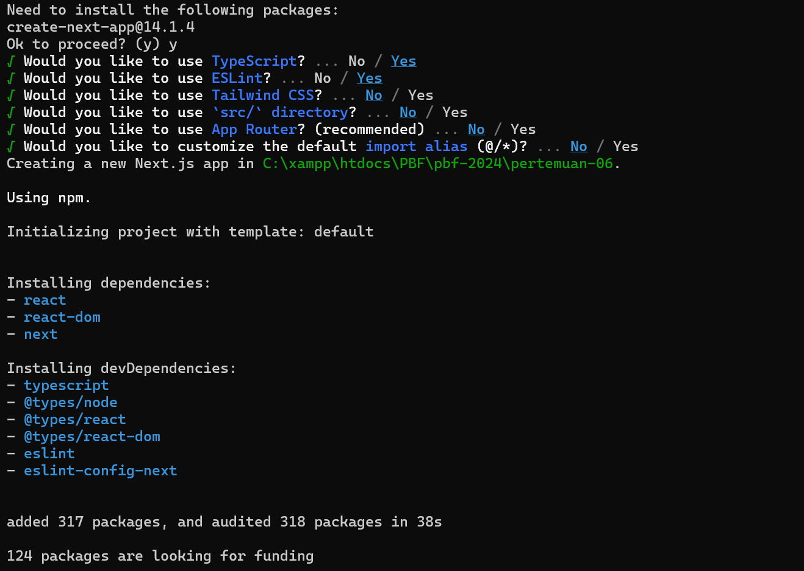

#### Langkah 2
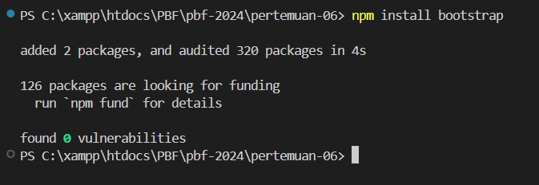

#### Langkah 3
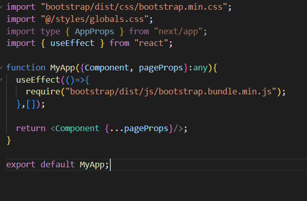

#### Hasil
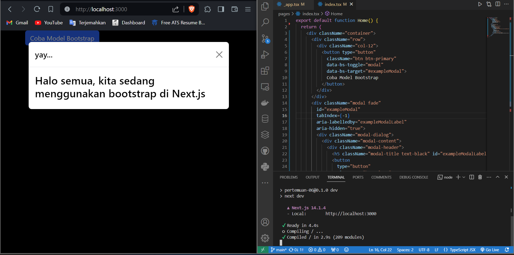

Bootstrap berhasil diterapkan dan class yang disediakan oleh bootstrap dapat dipakai pada nextJs dengan mengikuti langkah-langkah yang telah dijelaskan.

### Praktikum 2

#### Langkah 1
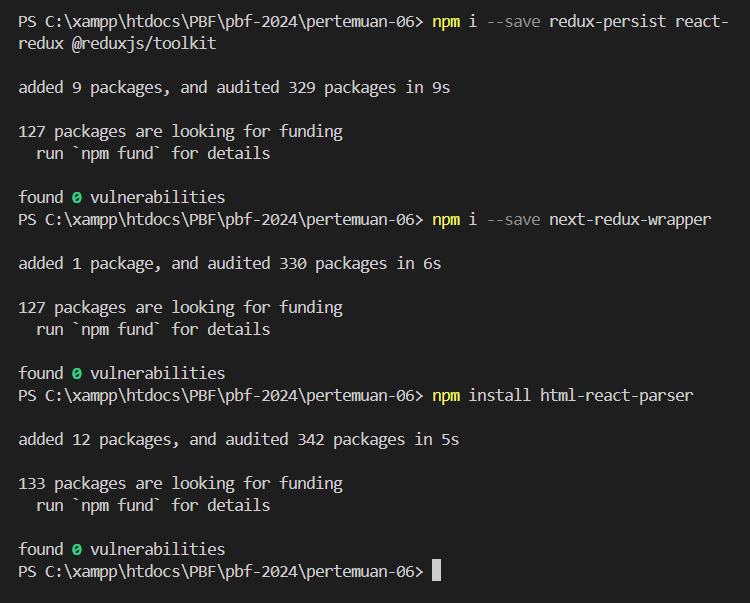

#### Langkah 2
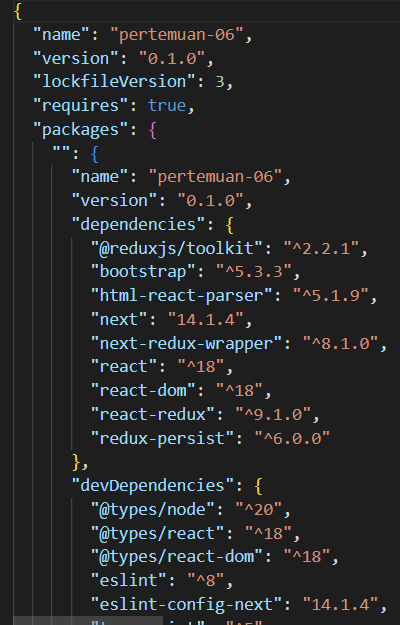

#### Langkah 3
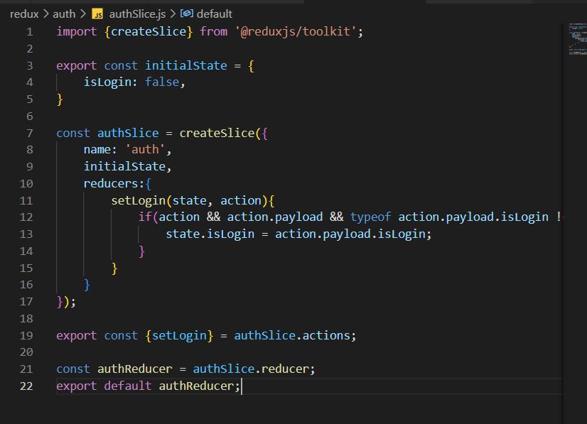

#### Langkah 4
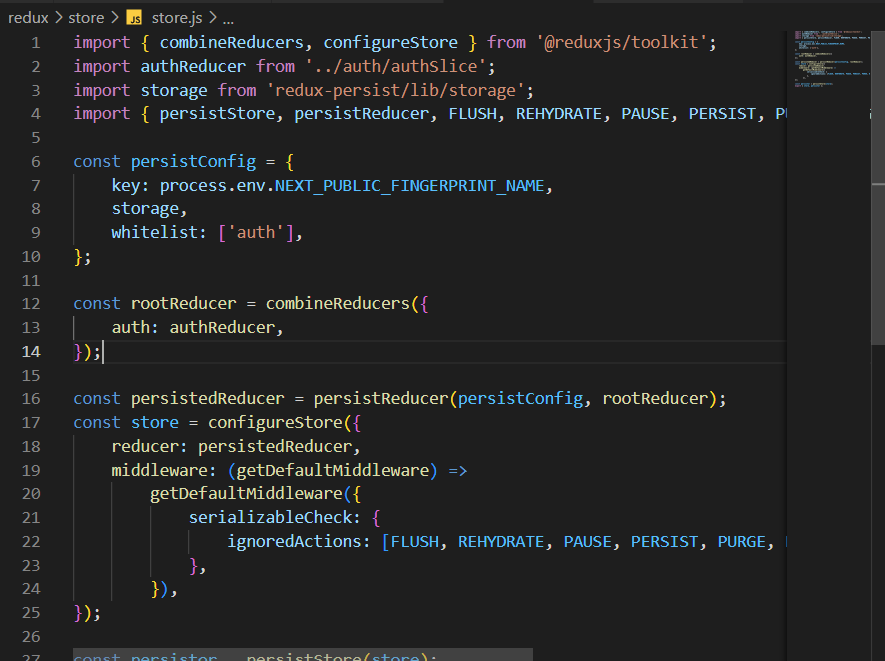

#### Soal 1
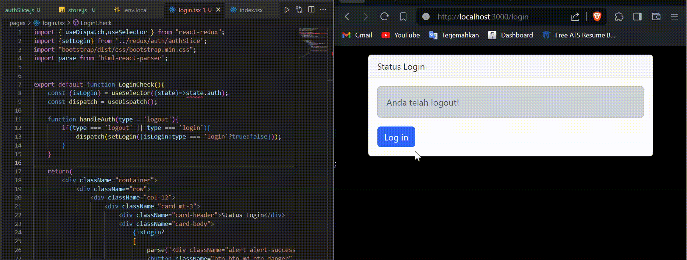

#### Soal 2
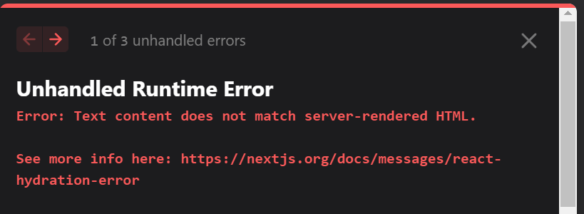
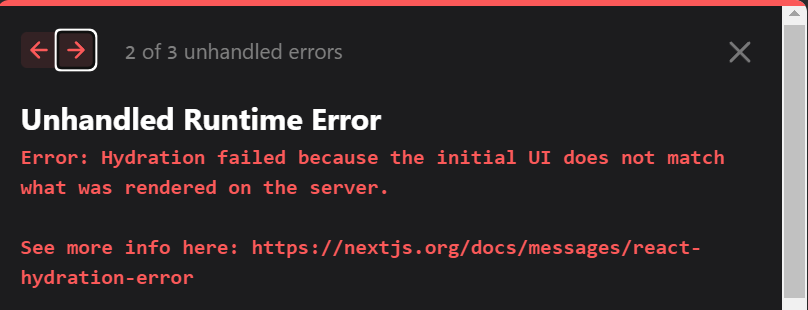
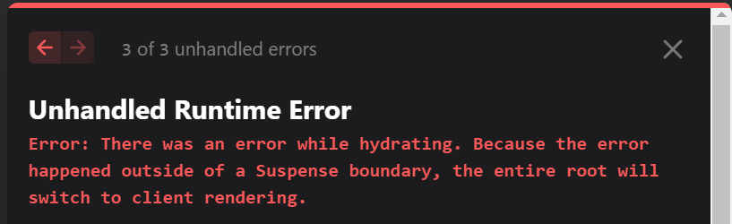

react tidak dapat mengkonversi string HTML menjadi elemen React secara otomatis. Sebagai gantinya,akan mengirimkan string HTML mentah ke JSX, yang tidak akan dikenali oleh React sebagai elemen React yang valid, sehingga akan muncul error tersebut.

### Praktikum 3

#### Langkah 1
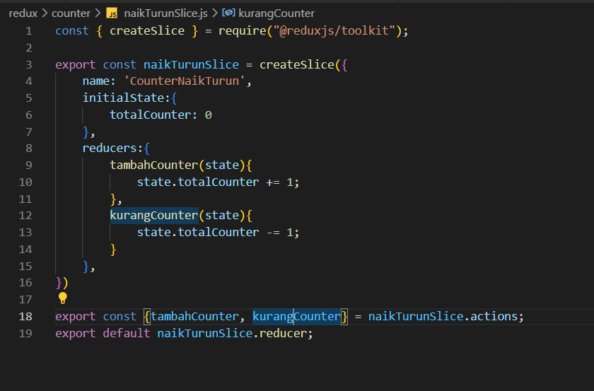

#### Langkah 2
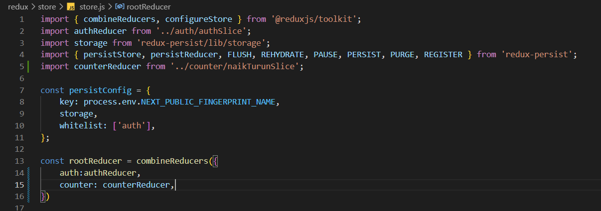

#### Langkah 3
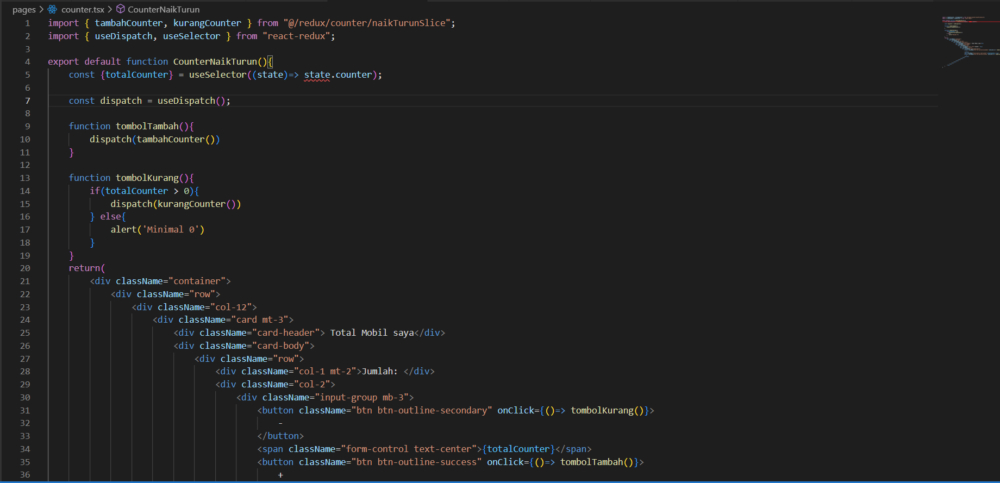

#### Hasil
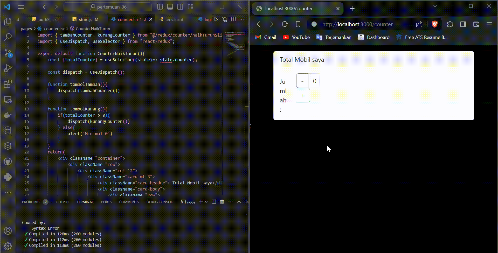

### Tugas Pertanyaan
1. Digunakan untuk mengimpor fungsi useEffect dari library React. _app.tsx adalah file khusus yang digunakan untuk mengonfigurasi aplikasi,yang mengatur hal-hal seperti layout global, pembaruan global, dan lain-lain.
2. ketika tidak menggunakan useEffect maka jika button modal diklik di index, maka popup tidak akan muncul karena tidak ada aksi apa apa ketika button tersebut di klik
3. agar tidak konflik dengan kata kunci `class` yang sudah ada di JavaScript
4. Bisa, redux reducer bisa disimpan lebih dari satu di store, seperti contoh praktikum ada 2 reducer, authReducer dan counterReducer, keduanya berada di 1 state tree.
5. kegunaan nya adalah untuk mengelola state dari proyek dan digunakan untuk menyimpan state ke penyimpanan lokal.
6. digunakan untuk mengambil data yang berasal dari state.auth dan disimpan dalam variabel isLogin
7. digunakan untuk mengambil data yang berasal dari state.counter dan disimpan dalam variabel totalCounter

## Contact Me

